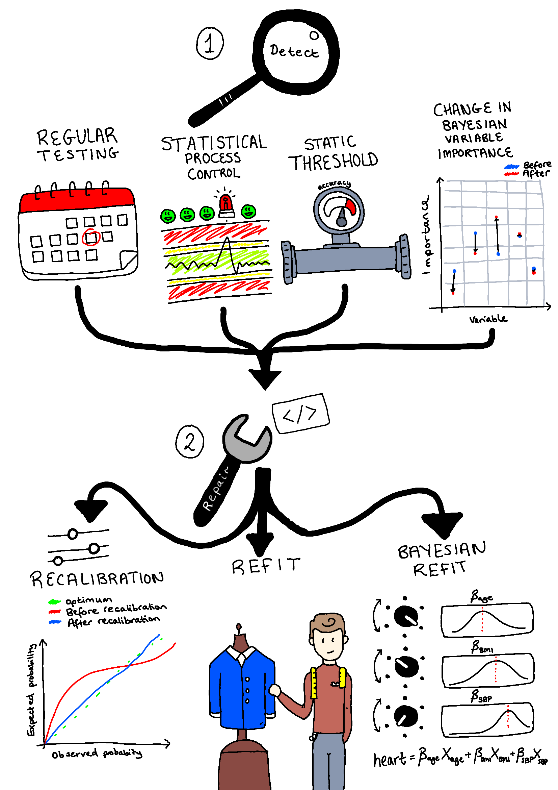

# PREDICT
PREDICT - Pragmatic Recalibration and Evaluation of Drift In Clinical Tools

[](https://opensource.org/licenses/BSD-3-Clause)

[](https://doi.org/10.5281/zenodo.15114705)


The PREDICT library provides a way to assess, and test potential repairs,
for binary prediction models that might drift over time.
Although originally designed for use in healthtech application,
the methods are applicable to any binary prediction model which might experience temporal drift.

## Getting Started

### Installation

To clone the repo:

`git clone https://github.com/sdrelton/PREDICT.git`

To create a suitable environment we suggest:
- Build conda environment and install requirements via `conda env create -f environment.yml`
- Activate environment `conda activate predict_env`


### Examples
We have a number of examples to demonstrate common use-cases.
- Example 1 - [Basic example of tracking metrics over time](Examples/basic_example_metrics.ipynb)
- Example 2 - [Recalibrating predictions when accuracy drops](Examples/recalibration_example.ipynb)
- Example 3 - [Recalibrating predictions at regular time intervals](Examples/regular_recalibration_example.ipynb)
- Example 4 - [Statistical process control of mock COVID data](Examples/spc_covid_example.ipynb)
- Example 5 - [Bayesian regression to predict heart attack during COVID using SBP and age](Examples/bayesian_example.ipynb)

### Detect and Repair Methodology Comparison
We compare methods to detect and repair temporal drift for four scenarios:

1) Fast predictor change - COVID pandemic
2) Slow predictor change - population-based BMI increase
3) Outcome drift - change in prevalence of myocardial infarctions
4) Multivariate drift - the importance of BMI increases whilst age is deemed less important by models



[Notebook for detection method comparison](Comparison/detect_comparison.ipynb)

[Notebook for comparing model performance from each PREDICT method](Comparison/performance_comparison.ipynb)

## Documentation
Full documentation generated by Sphinx can be found [here.](https://sdrelton.github.io/PREDICT/index.html)

## Team
The core PREDICT team is:
- Samuel Relton (s.d.relton@leeds.ac.uk)
- Zoe Hancox (z.l.hancox@leeds.ac.uk)
- Kate Best (k.e.best@leeds.ac.uk)
- Oliver Todd (o.todd@leeds.ac.uk)
- Barbara Hartley

The PREDICT project is funded by the National Institute for Health and Social Care Research (Grant NIHR206843).


## Test the code is working

To run the tests, use the following command in PowerShell:
```powershell
python -m pytest -v tests/
```

_The heart disease data used for testing this code can be found [here.](https://archive.ics.uci.edu/ml/machine-learning-databases/heart-disease/processed.cleveland.data)_

_Janosi, A., Steinbrunn, W., Pfisterer, M., & Detrano, R. (1989). Heart Disease [Dataset]. UCI Machine Learning Repository. https://doi.org/10.24432/C52P4X._
