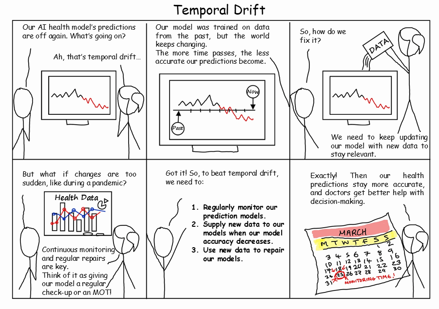

Welcome to PREDICT
===================================

The PREDICT project *(Pragmatic Recalibration and Evaluation of Drift In Clinical Tools)*
aims to improve the way that clinical prediction models are deployed and maintained.

Although this project is primarily focused on the UK healthcare system,
the tools and methods developed are applicable to any binary prediction model.

The PREDICT project is a research project funded by the 
National Insitute for Health and Care Research (`NIHR206843 <https://www.fundingawards.nihr.ac.uk/award/NIHR206843>`_) which aims to:

* Build software to help detect and repair temporal drift `Github`_
* Understand public opinion around the use of AI for clinical decision making, and deployment issues
* Raise the profile of this issue with relevant stakeholders, and suggest potential regulatory solutions

.. _Github: https://github.com/sdrelton/PREDICT

To contact the team, please email the project lead
Dr Samuel Relton (s.d.relton@leeds.ac.uk)

Upcoming Workshop
-----
The PREDICT workshop (~July 2026) aims to bring together national stakeholders to discuss how to 
handle temporal drift over the coming decade. As AI and predictive models become further embedded 
in the healthcare system, it is critical that we have robust monitoring to ensure they remain fit 
for purpose. We have secured delegates from the MHRA, NHSE, TPP, EMIS, academics, patient advocates, 
and other relevant groups. The main goals of the workshop are to:

1. Highlight the critical importance of this issue to successful integration of digital tools
2. Discuss the pros and cons of the approaches to monitoring and repairing drift
3. Examine potential regulatory approaches to ensure the longevity of digital health tools
4. Distil the discussion into a joint paper outlining our thinking on the issue

We'll be finalising the date and list of attendees in January 2026 so please look out for this.

In the meantime we have software available that implements these potential solutions, and will soon 
have publications that test these on real-life cases such as QRISK and the electronic frailty index. 
Please feel free to reach out if a demo of the software, or any additional info would be helpful.

Links
-----
* `Github code repository`_
* :ref:`Documentation <documentation>`
* :ref:`Newsletters on project progress <Newsletters>`

.. _Github code repository: https://github.com/sdrelton/PREDICT

Team
-----
The core PREDICT team is:

* Samuel Relton (s.d.relton@leeds.ac.uk)
* Zoe Hancox (z.l.hancox@leeds.ac.uk)
* Kate Best (k.e.best@leeds.ac.uk)
* Oliver Todd (o.todd@leeds.ac.uk)
* Barbara Hartley

Engagement Materials
-----
We have created a number of newsletters and podcasts to help engage with different stakeholders.

.. toctree::
   :maxdepth: 2
   :caption: Contents:

   Newsletters
   Podcasts

.. _documentation:

Documentation
-----
The full documentation for the PREDICT software,
the associated Github with examples of usage can be found `here`_.

.. _here: https://github.com/sdrelton/PREDICT

.. toctree::
   :maxdepth: 2
   :caption: Documentation:
   PREDICT
   Models
   Metrics
   Plots
   Triggers
   Tests

Indices and tables
------------------

* :ref:`genindex`
* :ref:`modindex`
* :ref:`search`